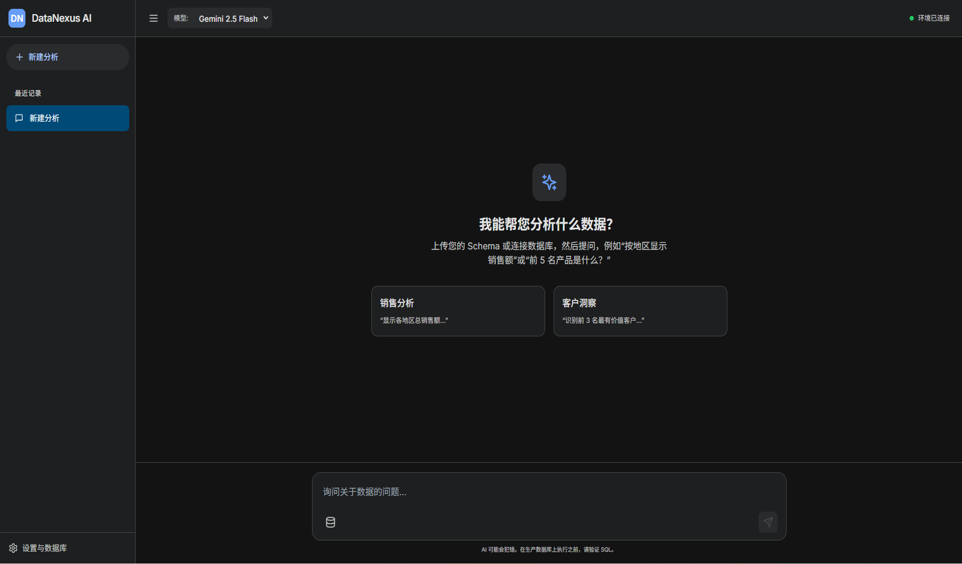
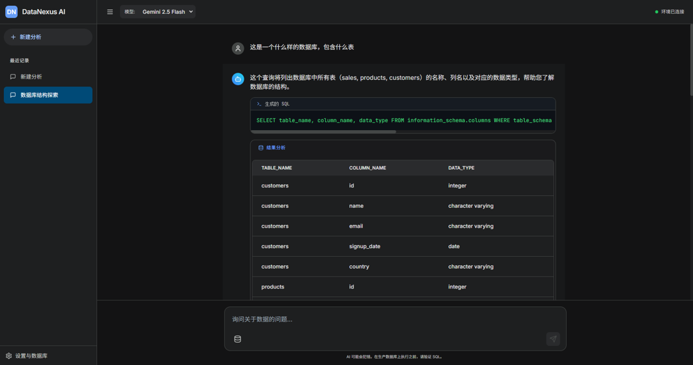
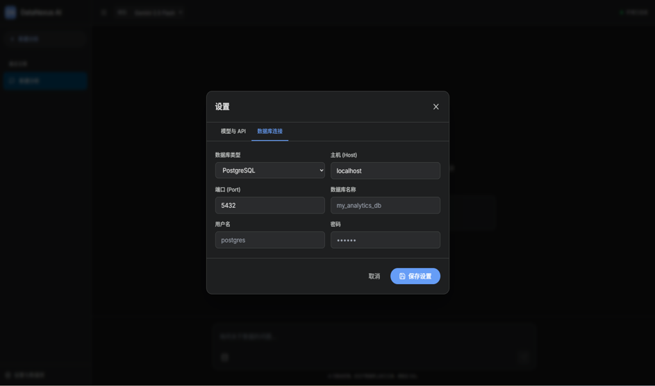
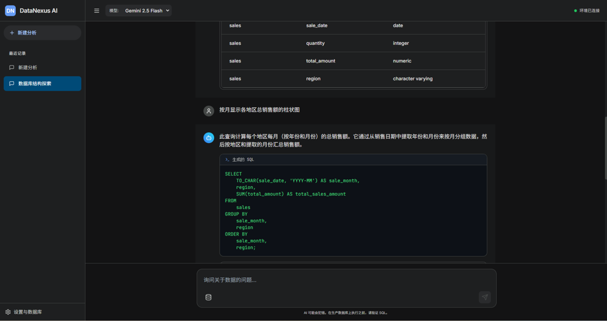
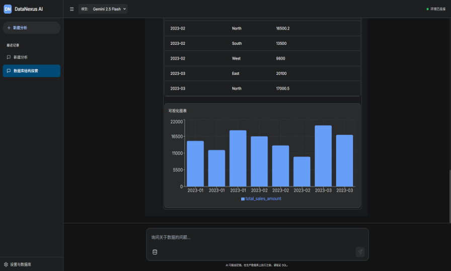

<div align="center">
  
</div>

# DataNexus AI

[English](README.md) | [中文](README_zh.md)

> 🔮 将自然语言转化为强大的 SQL 查询和精美可视化图表 — 无需 SQL 专业知识

DataNexus AI 是一个智能数据分析平台，让您使用日常语言与数据库进行交互。上传数据文件或连接数据库，用自然语言提问，即可获得即时 SQL 查询和美观的可视化图表。


## ✨ 功能特点

### 🤖 AI 驱动的 SQL 生成
将自然语言问题转化为精确的 SQL 查询。我们的 AI 代理理解您的意图，自动构建优化的查询语句。

### 📊 智能可视化
根据数据结构自动检测最佳图表类型。折线图、柱状图、饼图等 — 即时生成。

### 🗄️ 多数据源支持
- **文件上传**：CSV、Excel (.xlsx)、SQLite 数据库
- **数据库连接**：PostgreSQL、MySQL（通过连接字符串）

### 🧠 记忆增强对话
AI 记住您的对话历史，跨会话提供更准确、更具上下文意识的查询生成。

### 📚 知识库 (RAG)
上传文档构建自定义知识库。AI 使用检索增强生成来回答领域特定问题。

### 🔒 安全认证
带 JWT 令牌的用户认证系统。您的数据访问始终受到保护。

## 📸 截图展示

### 1. 侧边栏聊天记录 & 主界面展示

**功能：查询历史管理**
- 侧边栏按时间倒序显示历史查询列表
- 点击任一历史记录，主界面立即恢复该次完整对话和结果
- 可删除任一历史记录

**功能：查询结果展示**
- 提交查询后，主界面依次展示：用户问题、生成的SQL和结果表格
- 处理查询时显示加载状态，如"正在思考中…"
- 一键复制显示的SQL语句

**功能：自然语言输入**
- 点击"发送"按钮或按回车键提交查询
- 提交成功后输入框自动清空
- 输入框为空时不允许提交

---

### 2. 智能体多模态响应

智能体根据用户问题同时展示文字说明、SQL代码和查询结果数据，提供全方位洞察。

---

### 3. 数据库连接配置

**功能：数据库连接配置**
- 输入数据库类型、地址、用户名和密码后，系统连接并保存配置

**功能：连接测试**
- 点击"测试连接"按钮验证配置有效性
- 即时返回成功或失败提示

---

### 4. 长期记忆 (RAG)

**功能：RAG 记忆系统**
- 使用 RAG 方法保存长期历史对话记录，方便检索
- 用户可重命名、删除、新增长期记忆
- 技术涉及：记忆存储、检索、浓缩、注入

---

### 5. 智能数据可视化

**功能：自动渲染图表**
- 前端自动调用 Recharts 库渲染大模型返回的结构化 JSON 对应图表

**功能：切换图表类型**
- 可在渲染图表旁切换到 JSON 中建议的其他图表类型

**功能：生成 Python 代码**
- 选择"生成代码"显示绘制当前图表的 Python 代码

## 🚀 快速开始

### 前置要求

- Python 3.10+
- Node.js 18+
- Gemini API Key（或 OpenAI 兼容 API）

### 1. 克隆仓库

```bash
git clone https://github.com/sunweihao28/Text2SQL-agent.git
cd Text2SQL-agent/Text2sql
```

### 2. 启动后端

```bash
cd backend

# 创建虚拟环境
python -m venv venv
source venv/bin/activate  # Windows 下: venv\Scripts\activate

# 安装依赖
pip install -r requirements.txt

# 配置环境变量
cp .env.example .env  # 编辑 .env 填入您的 API 密钥

# 启动服务器
uvicorn main:app --reload --port 8000
```

### 3. 启动前端

```bash
cd frontend

# 安装依赖
npm install

# 配置环境变量
cp .env.example .env  # 编辑填入您的 API 密钥

# 启动开发服务器
npm run dev
```

### 4. 打开应用

在浏览器中访问 [http://localhost:5173](http://localhost:5173)

## 📖 使用指南

### 第一步：上传数据

点击侧边栏的 **上传** 按钮上传：
- 📄 CSV 文件
- 📊 Excel 文件 (.xlsx)
- 🗃️ SQLite 数据库

或前往设置页面连接现有的 PostgreSQL 数据库。

### 第二步：用自然语言提问

只需用日常英语输入您的问题：

```
"显示上个月收入最高的前10位客户"
```

```
"比较不同地区的销售业绩"
```

```
"每个产品类别的平均订单价值是多少？"
```

### 第三步：即时获取结果

- **SQL 查询**：查看带语法高亮的生成 SQL
- **执行**：运行前批准或修改
- **可视化**：自动生成美观的图表
- **洞察**：AI 驱动的结果分析

## 🏗️ 系统架构

```
┌─────────────────────────────────────────────────────────────┐
│                        前端                                  │
│                   React + Tailwind CSS                       │
│  ┌─────────────┐  ┌─────────────┐  ┌─────────────────────┐ │
│  │  聊天界面   │  │    设置     │  │    数据可视化       │ │
│  └──────┬──────┘  └──────┬──────┘  └──────────┬──────────┘ │
└─────────┼────────────────┼────────────────────┼────────────┘
          │                │                    │
          └────────────────┼────────────────────┘
                           │ REST API
          ┌────────────────┴────────────────────┐
          │                 后端                   │
          │           FastAPI + SQLAlchemy       │
┌─────────┴─────────┐  ┌──────────┴───────┐  ┌───┴───────────┐
│   认证路由        │  │   聊天路由        │  │  上传路由      │
└──────────────────┘  └──────────┬───────┘  └────────────────┘
                                 │
                    ┌────────────┴────────────┐
                    │    LLM 服务             │
                    │  (Gemini / OpenAI)     │
                    │  + RAG + 记忆          │
                    └────────────┬────────────┘
                                 │
          ┌───────────────────────┼───────────────────────┐
          │                       │                       │
┌─────────┴─────────┐  ┌─────────┴─────────┐  ┌─────────┴─────────┐
│   SQLite 数据库   │  │   文件存储         │  │   向量数据库       │
│  (sql_app.db)    │  │  (uploads/)       │  │  (ChromaDB)       │
└──────────────────┘  └───────────────────┘  └───────────────────┘
```

## 🛠️ 技术栈

### 后端
- **FastAPI** — 高性能 Web 框架
- **SQLAlchemy** — 数据库 ORM
- **Google Gemini** — 主 LLM
- **OpenAI** — 备选 LLM 支持
- **LangChain** — LLM 框架与 RAG
- **ChromaDB** — 知识检索向量数据库
- **Pandas** — 数据处理

### 前端
- **React 18** — UI 框架
- **Tailwind CSS** — 样式
- **Recharts** — 数据可视化
- **Lucide React** — 图标库
- **Vite** — 构建工具

## 📁 项目结构

```
Text2sql/
├── backend/
│   ├── main.py              # FastAPI 应用入口
│   ├── database.py          # 数据库配置
│   ├── models.py            # SQLAlchemy 模型
│   ├── schemas.py           # Pydantic schema
│   ├── auth.py              # 认证模块
│   ├── routers/
│   │   ├── auth.py          # 认证端点
│   │   ├── chat.py          # 聊天/SQL 端点
│   │   ├── upload.py        # 文件上传端点
│   │   ├── rag.py           # RAG 端点
│   │   └── connection.py     # 数据库连接端点
│   ├── services/
│   │   ├── llm_service.py   # LLM 集成
│   │   ├── enhanced_sql.py  # 增强 SQL 生成
│   │   └── rag_service.py   # RAG 服务
│   ├── utils/
│   │   └── db_utils.py      # 数据库工具
│   └── storage/             # 文件存储
│
└── frontend/
    ├── src/
    │   ├── App.tsx          # 主应用
    │   ├── components/      # React 组件
    │   │   ├── AuthPage.tsx
    │   │   ├── MessageBubble.tsx
    │   │   ├── SettingsModal.tsx
    │   │   └── DataVisualizer.tsx
    │   ├── services/
    │   │   └── api.ts       # API 客户端
    │   └── types.ts         # TypeScript 类型
    └── package.json
```

## ⚙️ 环境变量配置

### 后端 (.env)

```env
GEMINI_API_KEY=your_gemini_api_key_here
SECRET_KEY=your_secret_key_here
ALGORITHM=HS256
ACCESS_TOKEN_EXPIRE_MINUTES=1440
```

### 前端 (.env)

```env
VITE_API_URL=http://localhost:8000/api
```

## 🎯 使用场景

| 场景 | 示例问题 |
|------|----------|
| 销售分析 | "上季度最畅销的产品有哪些？" |
| 客户洞察 | "按Cohort显示客户留存率" |
| 财务报告 | "按地区生成月度收入明细" |
| 库存管理 | "哪些产品低于再订货阈值？" |
| 市场营销 | "哪些渠道带来最高转化率？" |

## 🤝 贡献

欢迎提交 Pull Request！

## 📄 许可证

MIT License — 详见 LICENSE 文件。

---

<div align="center">
  <strong>❤️ 由 DataNexus 团队构建</strong>
  <br>
  <a href="https://github.com/sunweihao28/Text2SQL-agent">GitHub</a> · <a href="https://github.com/sunweihao28/Text2SQL-agent/issues">问题反馈</a>
</div>
